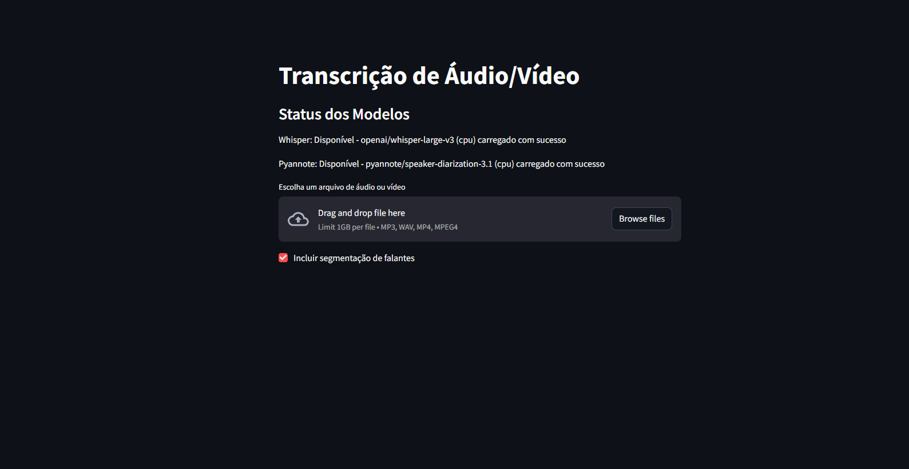

<a name="readme-top"></a>

<!-- PROJECT SHIELDS -->
[![Contributors][contributors-shield]][contributors-url]
[![Forks][forks-shield]][forks-url]
[![Stargazers][stars-shield]][stars-url]
[![Issues][issues-shield]][issues-url]
[![MIT License][license-shield]][license-url]
[![LinkedIn][linkedin-shield]][linkedin-url]

<!-- PROJECT LOGO -->
<br />
<div align="center">
  <a href="https://github.com/Dec0XD/audio-transcription-microservices">
    
  </a>
  <h3 align="center">Transcrição de Áudio/Vídeo com Segmentação de Falantes</h3>
  <p align="center">
    Uma aplicação de transcrição de áudio/vídeo com segmentação de falantes, usando uma arquitetura de microserviços com Streamlit, FastAPI, Whisper, AssemblyAI e Pyannote, otimizada para execução local com suporte a GPU.
    <br />
    <a href="https://github.com/Dec0XD/audio-transcription-microservices"><strong>Explore a documentação »</strong></a>
    <br />
    <br />
    <a href="https://github.com/Dec0XD/audio-transcription-microservices">Ver Demonstração</a>
    ·
    <a href="https://github.com/Dec0XD/audio-transcription-microservices/issues">Reportar Bug</a>
    ·
    <a href="https://github.com/Dec0XD/audio-transcription-microservices/issues">Solicitar Funcionalidade</a>
  </p>
</div>

<!-- TABLE OF CONTENTS -->
<details>
  <summary>Índice</summary>
  <ol>
    <li>
      <a href="#sobre-o-projeto">Sobre o Projeto</a>
      <ul>
        <li><a href="#construído-com">Construído Com</a></li>
      </ul>
    </li>
    <li>
      <a href="#primeiros-passos">Primeiros Passos</a>
      <ul>
        <li><a href="#pré-requisitos">Pré-requisitos</a></li>
        <li><a href="#instalação">Instalação</a></li>
      </ul>
    </li>
    <li><a href="#uso">Uso</a></li>
    <li><a href="#roadmap">Roadmap</a></li>
    <li><a href="#contribuição">Contribuição</a></li>
    <li><a href="#licença">Licença</a></li>
    <li><a href="#contato">Contato</a></li>
    <li><a href="#agradecimentos">Agradecimentos</a></li>
  </ol>
</details>

<!-- ABOUT THE PROJECT -->
## Sobre o Projeto

Esta aplicação permite aos usuários fazer upload de arquivos de áudio ou vídeo, convertê-los para o formato .wav, transcrevê-los usando o modelo Whisper da OpenAI ou AssemblyAI, e, opcionalmente, segmentar os falantes com o Pyannote. Construída com uma arquitetura de microserviços, ela separa a lógica de transcrição e diarização em serviços distintos, utilizando FastAPI para os endpoints e Streamlit para uma interface de usuário intuitiva. O projeto é executado localmente em Python, com suporte otimizado para GPUs NVIDIA (ex.: RTX 3060), aproveitando CUDA para acelerar o processamento. Para usuários de CPU, a diarização pode ser mais lenta, mas o sistema inclui notificações para gerenciar expectativas de tempo.

### Principais Recursos

- **Transcrição Automática**: Suporte a Whisper (local) e AssemblyAI (cloud) com seleção de modelo.
- **Segmentação de Falantes**: Identifica quem fala e quando, usando Pyannote, com filtragem de segmentos curtos ou silenciosos para maior robustez.
- **Interface Intuitiva**: Streamlit oferece uma UI simples com verificação de disponibilidade dos modelos.
- **Otimização para CPU/GPU**: Funciona em CPUs com tempos de processamento ajustados ou GPUs para maior rapidez.
- **Progresso no Terminal**: Exibe progresso da diarização no terminal.

<p align="right">(<a href="#readme-top">voltar ao topo</a>)</p>

### Construído Com
- Python
- Streamlit
- FastAPI
- Whisper
- AssemblyAI
- Pyannote
- PyTorch com CUDA
- pydub e FFmpeg
- librosa

<p align="right">(<a href="#readme-top">voltar ao topo</a>)</p>

<!-- GETTING STARTED -->
## Primeiros Passos

### Pré-requisitos
- Python 3.9+
- Conta no Hugging Face
- Conta na AssemblyAI (opcional)
- FFmpeg
- CUDA Toolkit 11.8 (opcional)
- cuDNN (opcional)
- Driver NVIDIA atualizado

### Instalação
```bash
git clone https://github.com/Dec0XD/audio-transcription-microservices.git
cd audio-transcription-microservices
python -m venv .venv
.venv\Scripts\activate  # Windows
pip install -r requirements.txt

# Suporte a GPU
pip uninstall torch
pip install torch --index-url https://download.pytorch.org/whl/cu118
```

**.env**
```
HF_TOKEN=seu_token_huggingface
AAI_API_KEY=seu_token_assemblyai
```

**Execução**
```bash
# Terminal 1 (Whisper local)
python transcription_service/whisper_model.py

# Terminal 2 (AssemblyAI, opcional)
python transcription_service/assemblyai_model.py

# Terminal 3 (Diarização)
python diarization_service/pyannote_model.py

# Terminal 4 (Interface)
streamlit run frontend/streamlit.py
```

<p align="right">(<a href="#readme-top">voltar ao topo</a>)</p>

<!-- USAGE EXAMPLES -->
## Uso

- Verifique os modelos na interface
- Faça upload de arquivos de áudio ou vídeo
- Escolha o modelo de transcrição e se deseja segmentação de falantes

**Exemplo com segmentação:**
```
Número de falantes detectados: 4
Speaker SPEAKER_01 (4.2s - 5.0s): O João pensou no botão, foi?
Speaker SPEAKER_00 (6.1s - 9.2s): Sim, ele pensou sim.
```

**Sem segmentação:**
```
Transcrição: O João pensou no botão, foi? Sim, ele pensou sim.
```

<p align="right">(<a href="#readme-top">voltar ao topo</a>)</p>

<!-- ROADMAP -->
## Roadmap

- [x] Implementar transcrição com Whisper
- [x] Adicionar suporte a AssemblyAI
- [x] Implementar segmentação de falantes
- [x] Suporte a GPU
- [ ] Suporte a .ogg, .flac
- [ ] Exportar transcrição
- [ ] Suporte a múltiplos idiomas
- [ ] Exibir progresso na interface

<p align="right">(<a href="#readme-top">voltar ao topo</a>)</p>

<!-- CONTRIBUTING -->
## Contribuição

1. Fork do repositório
2. `git checkout -b feature/NovaFuncionalidade`
3. `git commit -m 'Adiciona NovaFuncionalidade'`
4. `git push origin feature/NovaFuncionalidade`
5. Abra um Pull Request

<p align="right">(<a href="#readme-top">voltar ao topo</a>)</p>

<!-- LICENSE -->
## Licença

Distribuído sob a licença MIT. Veja `LICENSE.txt` para mais informações.

<p align="right">(<a href="#readme-top">voltar ao topo</a>)</p>

<!-- CONTACT -->
## Contato

André Coêlho - [Instagram](https://www.instagram.com/coelhoandrelucas/) - andrecoedev@gmail.com  
Projeto: [https://github.com/Dec0XD/audio-transcription-microservices](https://github.com/Dec0XD/audio-transcription-microservices)

<p align="right">(<a href="#readme-top">voltar ao topo</a>)</p>

<!-- ACKNOWLEDGMENTS -->
## Agradecimentos

- Streamlit
- FastAPI
- Whisper
- AssemblyAI
- Pyannote
- PyTorch
- NVIDIA CUDA
- FFmpeg

<p align="right">(<a href="#readme-top">voltar ao topo</a>)</p>

<!-- MARKDOWN LINKS & IMAGES -->
[contributors-shield]: https://img.shields.io/github/contributors/Dec0XD/audio-transcription-microservices.svg?style=for-the-badge
[contributors-url]: https://github.com/Dec0XD/audio-transcription-microservices/graphs/contributors
[forks-shield]: https://img.shields.io/github/forks/Dec0XD/audio-transcription-microservices.svg?style=for-the-badge
[forks-url]: https://github.com/Dec0XD/audio-transcription-microservices/network/members
[stars-shield]: https://img.shields.io/github/stars/Dec0XD/audio-transcription-microservices.svg?style=for-the-badge
[stars-url]: https://github.com/Dec0XD/audio-transcription-microservices/stargazers
[issues-shield]: https://img.shields.io/github/issues/Dec0XD/audio-transcription-microservices.svg?style=for-the-badge
[issues-url]: https://github.com/Dec0XD/audio-transcription-microservices/issues
[license-shield]: https://img.shields.io/github/license/Dec0XD/audio-transcription-microservices.svg?style=for-the-badge
[license-url]: https://github.com/Dec0XD/audio-transcription-microservices/blob/master/LICENSE.txt
[linkedin-shield]: https://img.shields.io/badge/-LinkedIn-black.svg?style=for-the-badge&logo=linkedin&colorB=555
[linkedin-url]: https://www.linkedin.com/in/andré-coêlho-b55b0622a/
